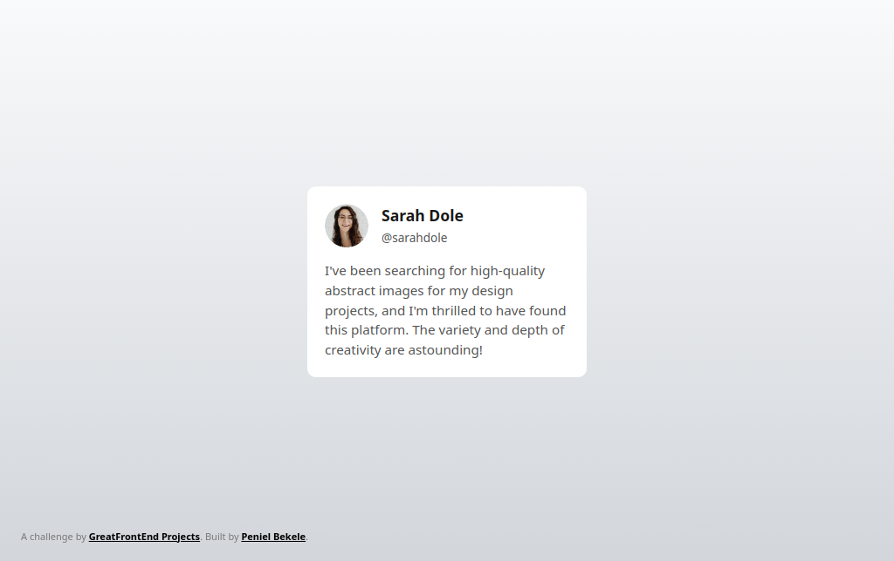

# GreatFrontEnd Projects Challenge - Testimonial Card

This is a **testimonial card** project created using **HTML** and **CSS**. It is a part of the GreatFrontEnd Projects Challenge and focuses on building responsive, well-styled components for modern web interfaces.

## 🚀 Features

- A clean and responsive design.
- CSS styling for a visually appealing layout.
- Testimonial card displays user image, feedback, and other details.
- Focused on good typography and spacing.

---

## 📂 Project Structure

```plaintext
Testimonial-Card/
├── README.md
├── css
│   └── style.css
├── designs
├── img
└── index.html
```

---

## 🛠️ Technologies Used

- **HTML** - For the structure of the card.
- **CSS** - For styling the card, including layout, colors, and responsiveness.

---

## 🎯 Goals of the Project

- Practice writing clean and semantic HTML.
- Learn and implement modern CSS properties.
- Build a visually appealing, responsive component.

---

## 📸 Screenshot



---

## 🔧 How to Use

1. Clone the repository:
   ```bash
   git clone https://github.com/penie1/Testimonial-Card.git
   ```
2. Open the project folder.
3. Open `index.html` in your browser.

## ✨ Acknowledgments

- Inspired by the **GreatFrontEnd Projects Challenge**.
- Thanks to the community for the motivation!
